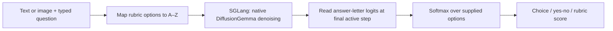
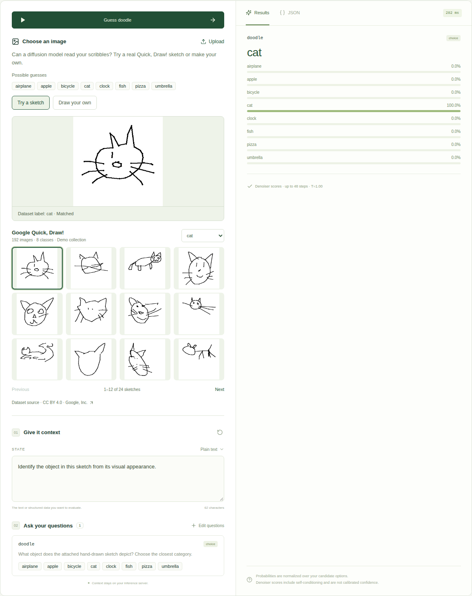

# Diffusion Jev / SGLang

Turn **DiffusionGemma into a local decision engine**: send text or an image plus typed questions, and receive choices, yes/no scores, and rubric scores with distributions. Includes a React playground, SGLang integration patches, reproducible benchmarks, and image demos.

This is an independent implementation of a **Jev-like interface**, using Google's open model. It does not contain TypeSafe's Jev weights, training method, or proprietary calibration. No fine-tuning is required.

- **[How it works and how to run it](docs/diffusiongemma.md)** — from image/text input to native denoising, answer-token logits, and typed decisions.
- **[Three-model comparison](reports/three-model-comparison/README.md)** — local DiffusionGemma, local LLaDA2.1-mini, and historical published Jev results.
- **[Image demos](docs/image-demos.md)** — flower identification and Doodle Detective: classify a sketch or draw your own.
- **[API reference](docs/api.md)** and **[remote browser access](docs/remote.md)**.

## From a diffusion model to a decision



Instead of asking the model to write probabilities in prose, the adapter reads actual model logits. It checks the checkpoint's empty thought prefix, gathers candidate letters at answer position 4, and maps the resulting distribution back to your labels. Each question runs as its own branch; SGLang can batch the branches.

These are **self-conditioned denoiser scores**, conditional on the choices you supply. They are not calibrated probabilities of being correct. Low candidate mass or a protocol error matters even when the normalized top score looks high. The [guide](docs/diffusiongemma.md#what-the-probabilities-mean) explains the exact readout and diagnostics.

## Run DiffusionGemma

Validated on Linux, Python 3.12, and **one NVIDIA A100 80GB** with a CUDA 13-compatible driver. The measured deployment uses about 49 GiB for weights and reserves about 72 GiB including KV pools. Keep the lightweight API environment separate from the GPU engine environment.

```bash
uv sync --locked
# Prepare the pinned model, SGLang source, and GPU environment first:
# see docs/diffusiongemma.md
uv run python scripts/launch_diffusiongemma.py \
  --model-path /path/to/diffusiongemma-model \
  --sglang-source /path/to/sglang-diffusiongemma \
  --engine-python /path/to/gemma-engine/bin/python
```

Open **http://localhost:8000**. The frontend is bundled; Node is only needed to change it. For a remote GPU, [forward the web port with SSH](docs/remote.md). The experimental SGLang source is pinned to `ef90bf677e4e6b280bf796f1c5f4ef0f05dda27f`; a generic `pip install sglang` is not a substitute for this integration.

Prepare the optional image galleries:

```bash
uv run python scripts/prepare_flowers.py
uv run python scripts/prepare_quickdraw.py
```

Under **Image classification**, choose **Flowers** or **Doodle Detective**. Doodle Detective includes 192 Google Quick, Draw! sketches across eight categories and a mouse/touch drawing pad. Uploaded images and drawings are processed by the local model. Dataset labels are not included in inference prompts. Downloaded datasets and model weights stay outside Git.



[Demo validation and dataset attribution](reports/doodle-demo/README.md).

## Measured results

Same 231 public JevBench items, with upstream scoring:

| Model | Correct | Accuracy | Median / p95 client latency |
|---|---:|---:|---:|
| Local DiffusionGemma 26B A4B | 196/231 | 84.8% | 183 / 392 ms |
| Local LLaDA2.1-mini | 152/231 | 65.8% | 172–190 / 2,324–2,346 ms |
| Official Jev 1.13.0, published historical run | 200/231 | 86.6% | 665 / 803 ms |

Local results use an A100 and loopback HTTP; the published Jev run includes a remote production API path. **This is not a controlled inference-speed comparison.** A fresh hosted Jev run has not completed. Full methodology, raw artifacts, and limitations are in the [comparison](reports/three-model-comparison/README.md).

Separate DiffusionGemma tasks: **98/100 flowers**, **42/50 Emojify sentences**, and **311/1,000 TweetEval tweets** (including 105 output-format failures). Doodle Detective is an interactive demo collection, not a held-out accuracy benchmark. Official Jev 1.13.0 and LLaDA2.1-mini are text-only; the local image demo uses DiffusionGemma's vision encoder.

## Run the earlier LLaDA backend

On **Linux x86-64, Python 3.11/3.12, an NVIDIA A100 80GB or compatible GPU, a CUDA-compatible C++ build toolchain, and a CUDA 13-compatible NVIDIA driver**, install [uv](https://docs.astral.sh/uv/getting-started/installation/), clone this repository, and run:

```bash
uv run diffusion-jev serve
```

Open **http://localhost:8000**. API documentation: **http://localhost:8000/docs**.

First launch installs the pinned engine dependencies and downloads approximately 32 GB of weights into the Hugging Face cache. Allow additional storage for CUDA/PyTorch and several minutes for first startup. No Node installation is needed to use the bundled webapp. The CLI waits for engine readiness and stops its child process group on Ctrl+C. Both servers bind to localhost by default. No Docker is required.

```bash
# Explicit provisioning, also useful before working offline:
uv sync --extra engine
uv run diffusion-jev doctor

# Attach to an already running, patched JevScoring engine:
uv run diffusion-jev serve --engine-url http://127.0.0.1:30000

# Show the UI while an externally managed model is still loading:
uv run diffusion-jev serve --engine-url http://127.0.0.1:30000 --no-wait-for-engine

# Use another Python environment with the pinned SGLang installed:
uv run diffusion-jev serve --engine-python /path/to/engine/bin/python

# Compare 1, 2, or 4 denoising passes (restart between runs):
uv run diffusion-jev serve --passes 2
```

The engine installer applies a small version-checked patch to the selected SGLang installation. Use a project-specific environment. See [the engine design](docs/engine.md) for the exact source patch and local-branch workflow.

## API

```bash
curl http://localhost:8000/v1/systemone \
  -H 'Content-Type: application/json' \
  -d '{
    "model": "diffusion-jev",
    "state": "I love you so much!",
    "questions": {
      "positive": {"type": "noul", "instructions": "Is the sentiment positive?"},
      "emotion": {
        "type": "choice", "instructions": "Choose the main emotion.",
        "criteria": {"love": null, "sadness": null, "anger": null}
      },
      "intensity": {
        "type": "score", "instructions": "Rate the emotional intensity.",
        "criteria": ["Neutral", "Mild", "Strong"]
      }
    }
  }'
```

- `noul`: a probability of yes, between 0 and 1.
- `choice`: winning option, complete candidate distribution, and confidence.
- `score`: expected **zero-based** rubric level, legend, distribution, and confidence.

The model alias is `diffusion-jev`; the full checkpoint name is also accepted. State and instructions can be strings, objects, or arrays. Question IDs are returned unchanged and are not sent to the model. See [API compatibility](docs/api.md) for explicit differences from [TypeSafe](https://docs.typesafe.ai/api).

## Evaluate and calibrate

The [emoji prediction benchmark](reports/diffusiongemma/emoji/README.md) measures the running DiffusionGemma service on five-category Kaggle Emojify and a frozen 1,000-item, 20-class TweetEval sample. It includes per-class scores, a matched published RoBERTa baseline, failure rates, latency, and development-only calibration. Prepare it with `python scripts/prepare_emoji_benchmark.py` and run it with `python scripts/benchmark_emoji.py` in the project environment.

Original examples are bundled; they are **smoke tests, not a representative benchmark**. Development and test files are separate.

```bash
uv run diffusion-jev benchmark src/diffusion_jev/data/emoji-dev.jsonl --output reports/dev.json
uv run diffusion-jev calibrate reports/dev.json --output calibration.json
# Restart with the fitted development temperature:
uv run diffusion-jev serve --calibration calibration.json
uv run diffusion-jev benchmark src/diffusion_jev/data/emoji-test.jsonl --output reports/test.json
```

Reports contain raw logits, probabilities, accuracy, negative log-likelihood, multiclass Brier score, 10-bin ECE, p50/p95 client-observed latency, and a dataset hash. Warmup requests are excluded. The calibration command refuses any report containing test records. Never select temperatures or prompts on the test set.

Optional [Kaggle Emojify](https://www.kaggle.com/datasets/alvinrindra/emojify): download it yourself under its applicable terms, inspect the CSV column names, and convert it:

```bash
uv run python scripts/import_emojify.py /path/to/data.csv \
  --text-column text --label-column label
```

The importer deduplicates text and uses a deterministic hash split so duplicate text cannot cross development/test boundaries. Third-party examples and Kaggle credentials are not bundled. Use meaningful emoji labels or edit the criteria descriptions if the source labels are numeric.

## Develop

```bash
uv sync
uv run pytest
uv run ruff check src tests scripts
# Optional frontend work:
cd web
npm ci
npm run build
```

The TypeScript frontend is built into `src/diffusion_jev/static` and included in the wheel. CI checks the API/scoring/calibration tests, Python lint, TypeScript build, and committed frontend reproducibility. GPU validation is recorded separately under `reports/`.

## Scope

Both backends score independent question branches, supporting up to 32 questions, 26 choice candidates, and 10 score levels. LLaDA uses one masked answer position; DiffusionGemma uses a native denoising canvas with an answer-position readout and supports images. SGLang batches branches; several question slots are not packed into one shared diffusion block. Prefix reuse is disabled. Candidate probabilities are conditional on the options and are not calibrated correctness estimates.

No claim of Jev-level accuracy or a speed advantage over direct Qwen scoring is made. A controlled comparison requires the same hardware, prompts, task sets, precision, warmup, and concurrency. See [the research protocol](docs/experiments.md).

Optional container packaging is supplied as `Dockerfile` and `compose.yaml` (`docker compose up --build`). It requires NVIDIA Container Toolkit. The uv workflow is primary; container builds are not part of the CPU CI checks.

Project code is [MIT licensed](LICENSE). Model and dataset licenses are separate; see [third-party attribution](THIRD_PARTY.md).

For a remote A100 with a Mac browser, see [SSH forwarding instructions](docs/remote.md). The browser and API share one forwarded port; inference remains on the remote GPU.

## AI Gateway and JevBench comparison

Server-side AI SDK examples and reproducible comparison scripts are described in [Gateway setup](docs/gateway.md). See the [DiffusionGemma comparison](reports/diffusiongemma/README.md) for the current text and image results, and the [earlier LLaDA comparison](reports/jevbench/README.md). Both explicitly label the TypeSafe Jev reference as historical.
