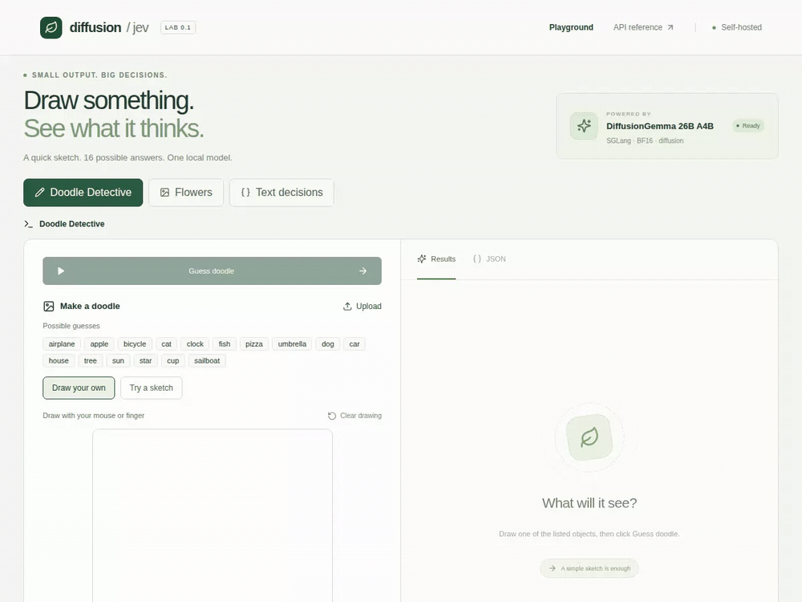
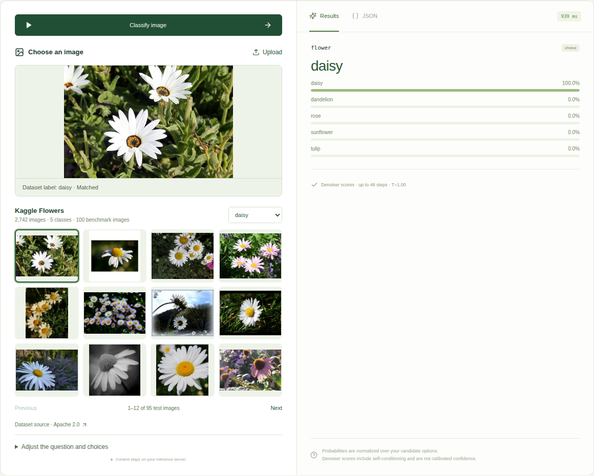
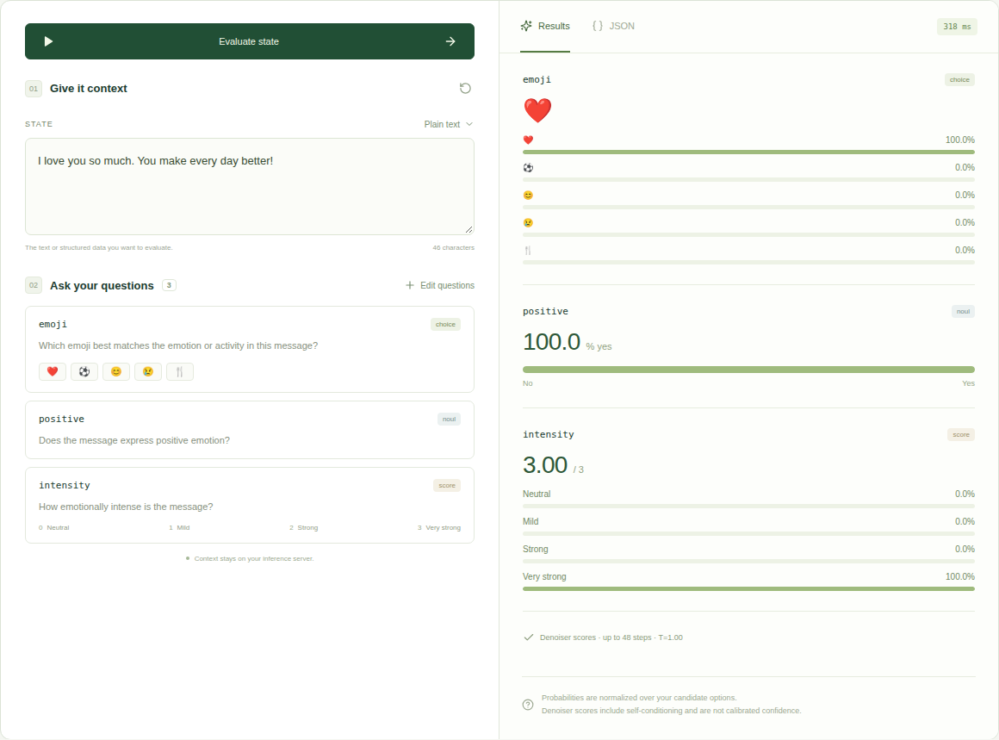

# Diffusion Jev — 用 DiffusionGemma 做视觉决策

[English](README.md) | **简体中文**

**让扩散模型猜涂鸦、认花，再给你的消息选一个 emoji。使用 DiffusionGemma 和 SGLang 构建。**

[打开体验页面](https://diffusion-jev-sglang.vercel.app/#doodle) · [模型](https://huggingface.co/google/diffusiongemma-26B-A4B-it) · [测试结果](reports/three-model-comparison/README.md) · [部署指南](docs/diffusiongemma.md)

**一个模型 · 三个演示 · 无需微调**

## 先看它能做什么

### 画一只猫 → 得到“cat”

[](https://diffusion-jev-sglang.vercel.app/#doodle)

输入一张随手画的涂鸦，模型返回 **cat（猫）**，同时显示16 个选项的分数。鼠标、手指都能画，也可以上传图片，或试试 **384 张 Google Quick, Draw! 涂鸦**。点击动图就能打开画板。

16 个选项是：**飞机、苹果、自行车、猫、时钟、鱼、披萨、雨伞、狗、汽车、房子、树、太阳、星星、杯子和帆船**。模型只能从这些选项中选择。

### 选一张花的照片 → 得到类别

[](https://diffusion-jev-sglang.vercel.app/#flowers)

选一张照片，点击 **Classify image（分类图片）**。这个例子里，模型从雏菊、蒲公英、玫瑰、向日葵和郁金香中选出 **daisy（雏菊）**。模型接收的是图片像素。预测完成后，网页才显示数据集标签，方便你核对。

### 写一句话 → 得到 emoji、是非判断和评分

[](https://diffusion-jev-sglang.vercel.app/#text)

输入 **“I love you so much. You make every day better!”**（我很爱你，有你在，每天都更美好），模型返回 **❤️**、**积极情感**，以及 **3/3** 的情感强度。一句话就能展示三种答案类型。你可以换一段文字，也可以修改问题，试试自己的决策任务。

这三个例子都来自本地部署的真实响应。它们是单独的演示，整体评测结果在下方。[涂鸦录制记录](reports/doodle-demo/README.md) · [图片与文本截图记录](reports/readme-demo/README.md)。

**体验公开服务时：** 为了省钱，GPU 会在空闲时关闭，第一次预测可能需要等几分钟。画画和浏览图库不会启动 GPU。

## 能做什么

- **读文字，也看图片：** DiffusionGemma 会结合图片像素和你的问题进行判断。
- **三种答案类型：** `choice` 选类别，`noul` 判断是非，`score` 对有序等级评分。
- **查看每个选项的分数：** 网页可以显示分布和原始结果。
- **自己部署：** 用 SGLang 在一张 GPU 上运行网页和决策 API。

这是一个独立项目，提供类似 Jev 的 API，使用 Google 发布的 DiffusionGemma 权重。它没有使用 TypeSafe 的 Jev 模型或概率校准。图片演示使用 DiffusionGemma；对比中的 Jev 1.13.0 和 LLaDA2.1-mini 接口只支持文本。

## 怎么实现

```text
  Picture or text + Question + Choices
                   |
                   v
         DiffusionGemma / SGLang
                   |
                   v
          Answer-letter scores
                   |
                   v
   Choice / Yes-no / Score + Distribution
```

图片或文字、问题和候选答案一起送入模型。我们先把选项映射成字母，比如 A 代表猫，B 代表时钟。DiffusionGemma 运行去噪过程后，适配器从最后一个有效步骤读取答案字母的分数，再映射回原来的标签。

每个问题对应一个模型请求，SGLang 可以批量处理这些请求。整个过程使用现有模型，不需要训练新的决策头。

**这些分数表示候选选项之间的相对偏好，不是经过校准的正确率。** 分数很高，也可能答错。[分数读取细节](docs/diffusiongemma.md#how-the-decision-engine-works) · [本地 API](docs/api.md)。

## 目前的测试结果

以下对比使用相同的 **231 道公开 JevBench 题目**。本地测试日期为 2026 年 9 月 21 日：

| 模型 | 答对数量 | 准确率 | 延迟中位数 / p95 |
|---|---:|---:|---:|
| 本地 DiffusionGemma 26B A4B | 196/231 | 84.8% | 183 / 392 ms |
| 本地 LLaDA2.1-mini | 152/231 | 65.8% | 172–190 / 2,324–2,346 ms |
| 官方 Jev 1.13.0，历史公开记录 | 200/231 | 86.6% | 665 / 803 ms |

本地模型运行在 A100 上。官方 Jev 数据来自之前公开的 API 测试。硬件和网络环境不同，不能用这张表判断哪个模型的推理速度更快。我们还没有完成新一轮官方托管 Jev 对比。公开体验页面还会增加排队、启动和网络耗时。

DiffusionGemma 的单独测试结果：**花卉 98/100**、**Emojify 42/50**、**TweetEval 311/1,000**。TweetEval 中有 105 次输出格式错误，已按答错计入。涂鸦演示还没有独立测试集的准确率结果。

[完整对比](reports/three-model-comparison/README.md) · [图片测试](reports/diffusiongemma/README.md) · [Emoji 测试](reports/diffusiongemma/emoji/README.md)

## 本地运行

已验证的环境是 **一张 NVIDIA A100 80GB**、Linux 和 Python 3.12。模型权重需要约 **50 GB 磁盘空间**，运行时引擎会预留约 **72 GiB 显存**。

```bash
git clone https://github.com/Hangzhi/diffusion-jev-sglang.git
cd diffusion-jev-sglang
uv sync --locked
```

先按[部署指南](docs/diffusiongemma.md)下载模型，准备指定版本的 SGLang 环境。然后把下面的路径换成你自己的路径：

```bash
uv run python scripts/launch_diffusiongemma.py \
  --model-path /path/to/diffusiongemma-model \
  --sglang-source /path/to/sglang-diffusiongemma \
  --engine-python /path/to/gemma-engine/bin/python
```

打开 **http://localhost:8000/#doodle**。仓库已包含构建好的网页。本地决策接口是 **`POST /v1/systemone`**。只有修改前端时才需要 Node.js。

如需示例图库，可以运行：

```bash
uv run python scripts/prepare_quickdraw.py
uv run python scripts/prepare_flowers.py
```

不下载图库也能自己画画。如果 GPU 在另一台机器上，请看 [SSH 端口转发指南](docs/remote.md)。

## 公开服务怎么部署

Vercel 提供网页、画板和图库。只有提交预测时，Modal 才会启动 A100。最多运行一个 GPU 实例，空闲窗口设为 60 秒。

公开服务的额度是 **每天 100 个预测任务、每月 1,000 个**，所有访客共享。另有独立的月度计算预算，达到预算后可能提前暂停预测。[部署自己的服务](docs/cloud-hosting.md)。

## 开发环境

| 部分 | 已测试的环境 |
|---|---|
| GPU 与系统 | A100 80GB · Ubuntu 24.04.3 |
| 模型运行环境 | Python 3.12.3 · PyTorch 2.13.0 · Transformers 5.12.1 |
| SGLang | 固定的实验版本，加上本仓库的分数读取补丁 |
| 前端 | Node.js 22.14.0 · React 19.1 · TypeScript 5.8.3 · Vite 6.4.3 |

[完整版本与源码提交记录](docs/development.md) · [已验证的 Modal 容器](docs/cloud-hosting.md)

```bash
uv sync --locked
uv run pytest
uv run ruff check src tests scripts deployment
cd web
npm ci
npm run build
```

构建结果会写入 `src/diffusion_jev/static`。详细技术文档目前以英文为主。

[数据准备与来源](docs/image-demos.md) · [评测方法](docs/experiments.md) · [LLaDA 后端](docs/engine.md) · [AI Gateway 示例](docs/gateway.md)

项目代码使用 [MIT 许可证](LICENSE)。模型权重和数据集有[各自的许可证](THIRD_PARTY.md)。
