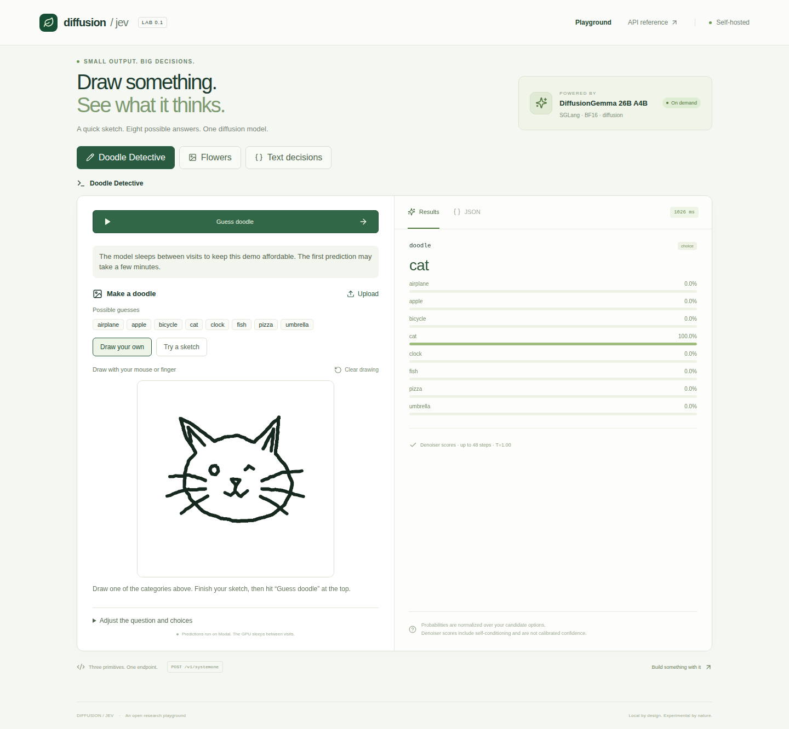
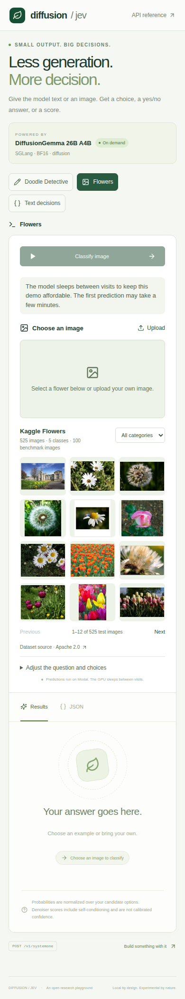

# Public demo checks

Checked on September 22, 2026 at [the public Vercel demo](https://diffusion-jev-sglang.vercel.app/#doodle).
These are integration checks, not a benchmark or an accuracy estimate.

| Input | Actual answer | Time seen by the client |
|---|---|---:|
| Hand-drawn cat, starting from no GPU worker | cat | 156.61 seconds |
| Prepared daisy photo | daisy | 5.78 seconds |
| Emoji text preset | heart emoji, positive, high intensity | 11.65 seconds |

The first request includes GPU allocation and model startup. The following requests
also include CPU API startup, queueing, network time and first-use compilation.
These numbers should not be compared directly with the local benchmark latencies.

All three requests used the real DiffusionGemma checkpoint and native SGLang
denoiser readout. No prediction was mocked or inserted into the page.

- The page opened with one static health request and no prediction requests.
- The browser drew a cat with mouse events and received the real model result.
- The sketch gallery loaded, and the flower gallery loaded on mobile.
- Filtering the gallery submitted no GPU jobs.
- The mobile page had no horizontal overflow or JavaScript errors.
- After the idle period, Modal reported zero GPU runners, zero running inputs,
  and zero queued jobs. A subsequent container listing was empty.
- Python checks: 56 passed, 3 skipped. Frontend type checking, build and Ruff passed.

[Raw browser check](validation.json), [flower and emoji responses](extra-predictions.json),
and [idle worker check](idle-check.json).

The deployment uses Vercel Hobby and one Modal A100 80GB with zero warm workers.
The GPU idle window is 60 seconds. Shared public allowances are 100 jobs per day,
1,000 per month, and 10 per minute. The owner set the separate workspace budget
to $50; the dashboard setting was not independently verified in this check.
See [deployment instructions and environment](../../docs/cloud-hosting.md).

## Expanded doodle choices

The September 22 update adds dog, car, house, tree, sun, star, cup, and sailboat.
The public app now offers 16 options and 384 Quick, Draw! sketches. The existing
525 flower images bring the public gallery total to 909.

A fresh public browser run drew a cat and received **cat**, with scores for all
16 choices. It took **137.79 seconds**, including the cold start. The desktop
gallery loaded, the mobile layout had no horizontal overflow, and no JavaScript
errors were observed. Browsing submitted no predictions; the run submitted one
real GPU job. This is an integration check, not a benchmark.

[Raw validation](expanded-validation.json) · [Public screenshot](expanded-doodle.png)

The updated [local recording and checks](../doodle-demo/README.md) also cover all
eight added gallery filters and real star and sailboat predictions.
