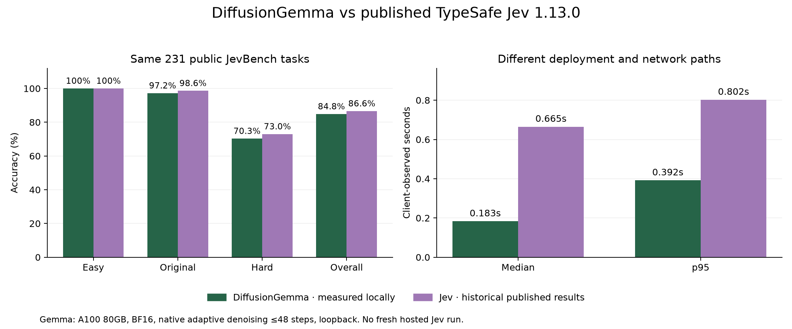
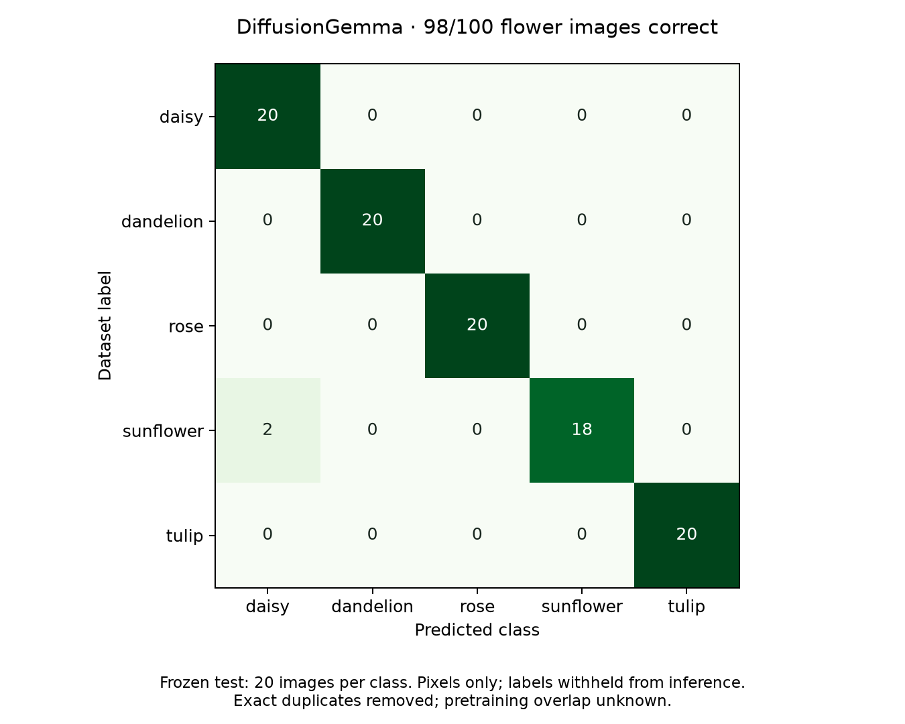

# DiffusionGemma: deployed service and benchmark results

Measured September 21, 2026 on one NVIDIA A100 80GB. **DiffusionGemma scored 196/231 (84.8%) on public JevBench and 98/100 on the frozen flower image test.** The same public text items have a published TypeSafe Jev 1.13.0 result of 200/231 (86.6%).

The later [emoji prediction benchmark](emoji/README.md) covers Kaggle Emojify and a 1,000-item TweetEval sample. Those are separate tasks and must not be folded into the JevBench accuracy below.

The web app is running at `127.0.0.1:8000` on the GPU host. With the existing SSH tunnel, open **http://localhost:18000** on the Mac. The **Image classification** tab has a prepared gallery, filters, pagination, uploads, and predictions. The endpoint accepts the model alias `jev` and reports the actual checkpoint identity. This is an independent service using Google's model, not TypeSafe's Jev weights.

## Text comparison

Both columns cover the exact same 231 public task IDs at JevBench commit `c6004e008ffba24aec091261ca1a5c02f7324702`, using upstream correctness scoring. The reference comes from the [published per-task artifact](https://github.com/fstandhartinger/jevbench/blob/c6004e008ffba24aec091261ca1a5c02f7324702/results/v1.2/jevbench-v1.2-per-task.json).

| Public subset | Local DiffusionGemma | Published Jev 1.13.0 |
|---|---:|---:|
| Easy | 48/48 — 100.0% | 48/48 — 100.0% |
| Original | 70/72 — 97.2% | 71/72 — 98.6% |
| Hard | 78/111 — 70.3% | 81/111 — 73.0% |
| **Overall** | **196/231 — 84.8%** | **200/231 — 86.6%** |

The observed gap is four tasks, or **1.73 percentage points**. Compared with our [earlier local LLaDA result](../jevbench/README.md) of 152/231 (65.8%), DiffusionGemma gets 44 additional tasks right, a **19.05-point improvement**. Across paired outcomes, only DiffusionGemma succeeds on eight items, only Jev succeeds on twelve, and both fail on 23. This single sample does not establish equivalent performance.

All 231 local responses contained valid distributions; there were no schema failures, transport failures, retries, or post-hoc distribution repairs. The run was serial, with two excluded warmups and no other GPU evaluation running during measurement.

| Client-observed latency | Local DiffusionGemma | Published Jev 1.13.0 |
|---|---:|---:|
| Median | 183.3 ms | 665.0 ms |
| p95 | 392.0 ms | 802.5 ms |

Local elapsed time was 52.30 seconds, or **4.42 valid decisions/second**. Local timings include the HTTP adapter over loopback on the A100 host; published Jev timings include TypeSafe's production API network path from Germany. These measurements do not isolate a model or hardware speed advantage. No concurrent-load benchmark of this Gemma deployment was performed.

**No fresh hosted Jev run completed:** the Gateway worker exited at startup because credentials were missing, before any hosted items were measured. See [gateway-status.json](gateway-status.json) and [Gateway setup](../../docs/gateway.md). The Jev column above is historical. Public artifacts provide correctness and timings but no matched probability vectors. This report covers 231 public tasks, not the full 534-item official ranking; no official rank or composite score is claimed. Public-data pretraining overlap is unknown, and paraphrase pairs make observations non-independent.

## Image classification

The test contains **100 frozen images, 20 per class**, drawn from the held-out test split before inference. The model receives image pixels and the five class descriptions. Source filenames and gold labels are withheld. No fine-tuning or temperature fitting was performed.

| Class | Correct |
|---|---:|
| Daisy | 20/20 |
| Dandelion | 20/20 |
| Rose | 20/20 |
| Sunflower | 18/20 |
| Tulip | 20/20 |
| **Total** | **98/100 — 98.0%** |

Both errors were sunflowers classified as daisies. All 100 responses had valid five-option distributions. Median latency was **396.7 ms**, p95 **509.3 ms**, including local image loading, vision encoding, and the HTTP adapter. The serial measured phase took 40.89 seconds, following two excluded warmups with a development image. There were no retries. Chance accuracy is 20%; no hosted Jev image result was measured.

The gallery is prepared from [Kaggle Flowers, version 1](https://www.kaggle.com/datasets/abdelrahmanatef01/flowers-dataset-for-image-classification), whose uploader declares Apache 2.0. Exact decoded-pixel deduplication removed three repeated entries and one unique image with conflicting labels. The resulting **2,742 images** are split deterministically into **1,929 train, 288 development, and 525 test** images. Near-duplicates may remain, and pretraining overlap is unknown. Thus 98% describes this small public flower test, not general visual accuracy.

Images and the full manifest are under `/workspace/diffusion-jev-sglang/data/flowers/`. Prepared images have opaque SHA256 filenames, corrected EXIF orientation, RGB JPEG encoding, and a maximum side length of 768 pixels. [dataset.json](dataset.json) records provenance, archive SHA256, counts, and the frozen benchmark IDs. Images are excluded from Git; [the preparation script](../../scripts/prepare_flowers.py) recreates them.

## Interpreting the scores

The service reads answer-letter logits from each request's last active native denoising step and applies a T=1 softmax over the supplied options. Earlier denoising steps condition these logits on the developing answer. **The returned distributions are not calibrated correctness probabilities or independent masked-token likelihoods.**

| Local diagnostic | Text tasks | Flower images |
|---|---:|---:|
| Negative log-likelihood | 0.8336 | 0.3183 |
| Multiclass Brier score | 0.2587 | 0.0402 |
| 10-bin expected calibration error | 0.1222 | 0.0211 |
| Wrong answers with top probability ≥90% | 20/35 | 2/2 |

On ten text tasks with exact gold distributions, mean total variation distance was **0.3666**. Strong classification accuracy therefore does not imply strong probabilistic reasoning. Ordinal mean absolute error was 0.1233 rubric levels.

Candidate mass checks matter: every text item assigned at least 99.628% of its full-vocabulary mass to offered options, but **one image assigned only 0.0000086%** to them. Its unrestricted answer token was `None`; renormalizing over the five flower options nevertheless produced the dataset's correct class. The reported 98% is constrained five-option accuracy. This case remains in the denominator and is recorded in [score-diagnostics.json](score-diagnostics.json). The API exposes candidate mass and the unrestricted answer token so consumers can implement abstention separately.

Configured `passes=48` is a maximum, not the actual number executed. Text requests used 2–6 steps (212/231 used two); images used 2–8 (85/100 used two). Detailed counts are saved with the diagnostics.

## Runtime and validation

The checkpoint is [google/diffusiongemma-26B-A4B-it](https://huggingface.co/google/diffusiongemma-26B-A4B-it), revision `f7f5b7f5fa82ffc52addd066915886d497f5517b`. SGLang uses commit `ef90bf677e4e6b280bf796f1c5f4ef0f05dda27f` from experimental [PR 34061](https://github.com/sgl-project/sglang/pull/34061), with version-checked local patches. This is not support from the project's older released SGLang dependency.

BF16 native `Gemma4Renoise` uses a 256-position canvas, at most 48 adaptive steps, seed 42, synchronous scheduling, Triton attention, an 8,192-token context, and up to four running requests. CUDA graphs and prefix caching are disabled. Weights occupy about 49 GiB; the current service reserves about 72 GiB including KV pools. Exact packages, configuration, and patch hashes are in [environment.json](environment.json).

Two implementation details are essential. A context-admission correction fixes an upstream path that advertised 256 tokens for a 90-token prompt and caused an out-of-bounds CUDA attention read. Separately, even with thinking disabled the model generates four empty-thought protocol tokens before its answer. The adapter verifies those tokens and reads answer position 4, retaining each batch row's last active logits. Native sampling math, stopping, and weights remain unchanged. [The setup guide](../../docs/diffusiongemma.md) explains the patches, launch commands, and benchmark reproduction.

Validation completed:

- Python suite: 45 passed, two tensor-dependent tests skipped in the lightweight API environment.
- New readout tensor test in the engine environment: one passed. Native SGLang GPU sampler and Q/K normalization checks: two tests and four subtests passed.
- Python lint and frontend production build passed.
- Real browser checks passed for text decisions, gallery pagination/filtering, image prediction, uploaded-image prediction, JSON metadata, and mobile layout, with no JavaScript errors. See [browser-smoke.json](browser-smoke.json), [desktop](vision-desktop.png), and [mobile](vision-mobile.png).
- Completed text and image runs exercised the real API and GPU. Final service readiness and dataset availability are recorded in [deployment-check.json](deployment-check.json).

Raw text records: [local.jsonl](jevbench/local.jsonl), [run metadata](jevbench/local-run.json), [quality metrics](jevbench/comparison.json), [matched published comparison](jevbench/published-comparison.json). Raw image records: [predictions.jsonl](flowers/predictions.jsonl), [run metadata](flowers/run.json), [summary](flowers/summary.json).
