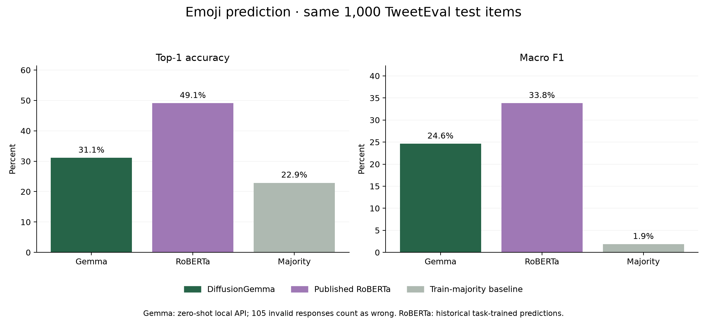
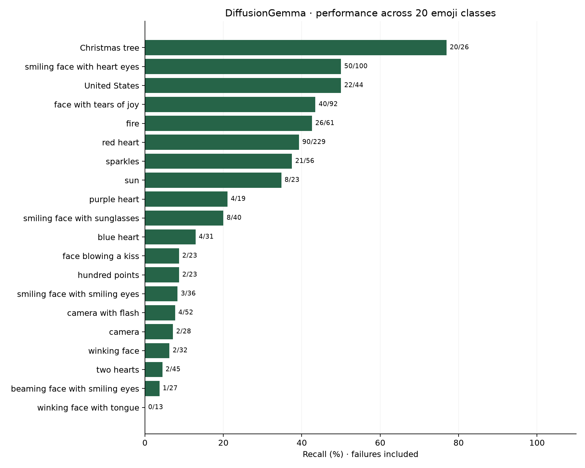

# Emoji prediction benchmark

Measured September 21, 2026 through the running DiffusionGemma Jev-compatible API on one A100 80GB. Two tasks measure different uses: mapping short sentences into five broad emoji categories, and predicting an author's choice among 20 overlapping emoji classes in real tweets.

| Test | Top-1 accuracy | Macro F1 | Top-3 accuracy | Valid responses | Median / p95 |
|---|---:|---:|---:|---:|---:|
| Emojify, five classes | 42/50 — 84.0% | 83.0% | 94.0% | 50/50 | 178.1 / 292.7 ms |
| TweetEval, 20 classes | 311/1000 — 31.1% | 24.6% | 47.8% | 895/1000 | 194.6 / 428.3 ms |

Invalid responses count as wrong in accuracy, top-3 accuracy, per-class recall, and macro F1. Probability metrics use valid responses only. Macro F1 averages the classes equally, which matters because TweetEval contains many more heart examples than some other emoji.

## Comparisons and uncertainty

On the exact same 1,000 TweetEval source indices, the [published TweetEval RoBERTa predictions](https://github.com/cardiffnlp/tweeteval/tree/4fbd22cd78421f05b1ecdb4fc5725bc7a7bd8f66/predictions) score **491/1000 (49.1%) accuracy and 33.8% macro F1**. This is a historical task-trained baseline; DiffusionGemma uses no task training or few-shot examples. The local sample is not the complete official test set and does not establish a leaderboard rank. No RoBERTa latency or probability comparison was measured.

A constant label selected from training frequencies gets 30.0% accuracy on Emojify and 22.9% on TweetEval. Uniform random expected accuracy is 20% and 5%, respectively.

DiffusionGemma is 18.0 percentage points below the trained RoBERTa baseline on this sample. Output-format failures account for at most 10.5 points if the existing valid predictions stay fixed, so improving the response protocol alone would not close the entire gap.

Wilson 95% intervals for top-1 accuracy are 71.5%–91.7% for Emojify and 28.3%–34.0% for TweetEval. These are descriptive item-level intervals; they do not account for near-duplicates, author clusters, subjective labels, or unknown pretraining overlap.

**No official hosted Jev emoji result was measured.** The previously reported 231-task JevBench figures cover different tasks and cannot be reused as an emoji baseline. Gateway credentials were unavailable for a hosted comparison in the preceding deployment work.



## Frozen datasets and task definitions

**Emojify:** [Kaggle `alvinrindra/emojify`, version 2](https://www.kaggle.com/datasets/alvinrindra/emojify). Its headerless CSVs contain 132 training and 56 test rows. One training duplicate and six test duplicates/overlaps are removed. The result is 111 training rows, 20 development rows (four per class), and all 50 retained original test rows. The combined CSV is never merged into either split. Classes are love ❤️, sports ⚾, happiness 😄, sadness/distress 😞, and food 🍴. These represent the source numeric classes; the small web demo uses different icons for some categories.

**TweetEval:** [Cardiff NLP source](https://github.com/cardiffnlp/tweeteval/tree/4fbd22cd78421f05b1ecdb4fc5725bc7a7bd8f66/datasets/emoji), commit `4fbd22cd78421f05b1ecdb4fc5725bc7a7bd8f66`. After duplicate/conflicting-label filtering, 44,389 training, 4,807 validation, and 49,937 test rows remain. Salted SHA256 order selects 200 development and 1,000 test rows without class balancing. All 20 original labels are retained. Gold labels represent the emoji originally used by the author, so an alternative sensible emoji is still scored wrong. Upstream text formatting is retained for inference.

Deduplication matches NFKC-normalized, case-folded text with collapsed whitespace. Conflicting-label groups are removed before sampling; repeated text keeps its earliest split. Near-duplicate detection is not performed. The samples, option order, descriptions, and prompts were frozen before test inference. No weights or prompts were fitted on test labels.

Raw source files, prepared JSONL, and directly reusable API request bodies are saved under `/workspace/diffusion-jev-sglang/data/emoji-benchmark/{emojify,tweeteval}/`. Each `manifest.json` records source hashes, selection rules, source row counts, and prepared-file hashes. Raw corpora remain outside Git. Kaggle reports an unknown license, and TweetEval's emoji subset does not specify a separate license; provenance is retained without asserting an unrestricted redistribution license.

## Reliability and confidence

The completed TweetEval test has **105 invalid responses**, all rejected with HTTP 503 because the native generation did not match the adapter's required empty-thought prefix. Accuracy among the 895 valid responses is 34.7%; the headline result includes all 1000 requests. The first development-only attempt stopped after three consecutive rejections; it is preserved under `incomplete-dev/`. The harness was corrected to check server readiness and continue counting individual failures. The development run was repeated before touching the frozen test set. Model weights, prompts, and inference behavior were not changed.

Candidate scores come from the last active self-conditioned denoising step. They are not calibrated correctness probabilities. The following temperature fits use exclusively valid development records and were frozen before test inference. The calibrated columns are an offline transformation of saved logits; the running web app remains at T=1.

| Test | Dev-fitted T | Raw NLL → calibrated | Raw Brier → calibrated | Raw ECE → calibrated | Wrong answers with raw top probability ≥90% |
|---|---:|---:|---:|---:|---:|
| emojify | 6.237 | 2.898 → 0.622 | 0.321 → 0.286 | 0.164 → 0.038 | 8 |
| tweeteval | 6.998 | 10.138 → 2.463 | 1.278 → 0.843 | 0.635 → 0.083 | 542 |

Temperature search uses the existing 401-point geometric grid from 0.1 to 10. A positive temperature preserves the class ranking and does not resolve invalid responses. The small development samples limit calibration conclusions.

Full-vocabulary candidate mass fell below 50% on 0 valid Emojify responses and 4 valid TweetEval responses. Candidate normalization can hide out-of-option answers; retain the raw diagnostics when deciding whether to abstain.



## Reproduce and inspect

The runtime is unchanged from the [DiffusionGemma deployment](../README.md): pinned model/source, BF16, native 256-position diffusion canvas, at most 48 steps, no prefix caching or CUDA graphs. Each benchmark uses serial requests, two excluded training-example warmups, zero retries, and no competing evaluation job. `run.json` records timings, actual model identity, file hashes, and calibration timing. The app and model remain running.

```bash
cd /workspace/diffusion-jev-sglang
# For a new data copy, choose an unused output directory:
.venv/bin/python scripts/prepare_emoji_benchmark.py --output data/emoji-repeat
# Existing frozen data; always write each new run to an unused report directory:
.venv/bin/python scripts/benchmark_emoji.py --output reports/emoji-repeat
# Render the original completed report:
uvx --with matplotlib python scripts/render_emoji_report.py
```

For each task, `dataset.json` and `selection.json` capture the frozen setup and source indices; `dev-predictions.jsonl` and `test-predictions.jsonl` retain individual failures, predictions, distributions, logits, and latency. `test-summary.json`, `test-calibrated-summary.json`, `calibration.json`, and `baselines.json` provide the aggregate results. The archived original harness accompanies the initial development attempt and the unchanged Emojify measurements.

Validation covers headerless CSV parsing, duplicate/conflict exclusion, stable sampling, failure-inclusive metrics, model/configuration drift, distribution/logit consistency, gold-label exclusion from requests, and completing a run despite individual protocol failures while the server is healthy.

The full Python suite passed **52 tests**, with two tensor-dependent skips in the API environment; seven tests specifically cover this benchmark. Lint passed. Macro F1 was independently checked with scikit-learn, and published gold/prediction alignment was verified against all 1,000 selected source indices. [validation.json](validation.json) records metric agreement, package version, artifact hashes, and final service health.
