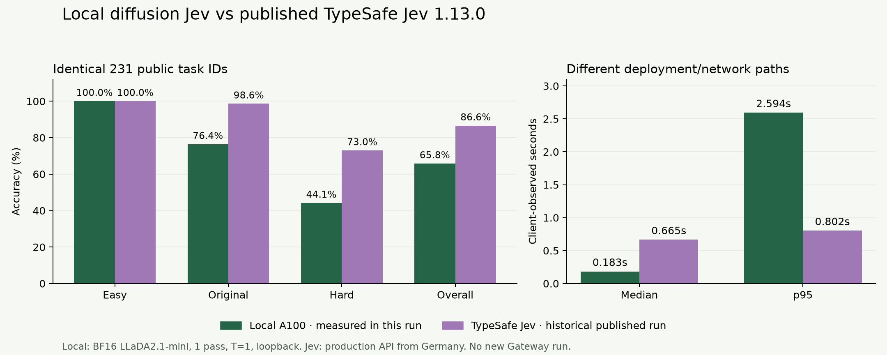

# Local diffusion Jev versus TypeSafe Jev

Measured September 21, 2026. **Your local model was run live. The TypeSafe Jev 1.13.0 column is a historical published reference, not a new Vercel Gateway request.** A replacement Gateway credential was unavailable, so the cloud example could not authenticate and its setup is not claimed verified.

On the exact same 231 public task IDs, local accuracy was **65.8%**, versus **86.6%** for published Jev, a **20.8 percentage-point gap**. Both solved every easy item; Jev's advantage appears on original and hard decision tasks.

| Set | Items | Local BF16 LLaDA2.1-mini | Published Jev 1.13.0 |
|---|---:|---:|---:|
| Easy | 48 | 48/48 (100.0%) | 48/48 (100.0%) |
| Original | 72 | 55/72 (76.4%) | 71/72 (98.6%) |
| Hard | 111 | 49/111 (44.1%) | 81/111 (73.0%) |
| Overall | 231 | 152/231 (65.8%) | 200/231 (86.6%) |

## Timing

| Client-observed latency | Local, measured now | Jev, published historical |
|---|---:|---:|
| Median, all 231 | 183 ms | 665 ms |
| p95, all 231 | 2,594 ms | 803 ms |
| Hard median | 587 ms | 672 ms |
| Hard p95 | 3,131 ms | 846 ms |

The local median is lower, but its slow tail is substantially higher. Local measurements use loopback on the A100 server. JevBench measured TypeSafe's production endpoint from a server in Germany; this is not a measurement of the current Vercel route. Different networks, measurement times, model versions and workloads prevent a hardware-matched speed claim. No artificial latency multiplier was applied. All tasks were serial, with one attempt per task and two warmups excluded from the new local run.

## Where your model differs

- Hard tasks: **44.1% versus 73.0%**. Your model scored 6/19 on long policies, 5/18 on multi-hop tasks, and 3/15 on temporal/numeric tasks. Simple extraction, easy facts, and the five hard routing items were all correct.
- Same-item disagreement: published Jev alone was correct on **53** items; local alone on **5**; both were wrong on **26**. This compares outcome codes, not predicted text or probability vectors from the historical run.
- Confident errors: your model was wrong on **79** items, including **24** with top-option probability at least 90%. One example: it denied CSV export to a trial account even though the given policy explicitly allowed it, with 94% probability on the wrong answer. A second denied entry to a registered contractor despite the explicit escort exemption, with 96% probability on the wrong answer.
- Local calibration: multiclass Brier **0.491**, ECE **0.204**, NLL **1.020**; hard ECE **0.359**. Mean total variation distance from the ten exact gold distributions was **0.346**. Lower is better. These are normalized candidate probabilities, not a demonstrated guarantee of correctness.
- All **231/231** local responses had valid probability distributions, with zero transport failures. All 18 score questions were included; ordinal expected-value MAE was **0.317** levels.

The result suggests the current one-pass LLaDA setup is useful for simple bounded classification, but it does not yet match Jev's decision quality on this public test. The emoji smoke test did not reveal this gap. Improving reasoning quality and calibrating on separate development data would matter more than reducing short-request latency further. Do not tune prompts, thresholds or temperatures on these scored items and then call the same test held out.

## Method and artifacts

Local: inclusionAI/LLaDA2.1-mini, checkpoint 20e64e2ad21644d0e5248586ed9c942cdd45de0f, SGLang 0.5.12.post1 with included scoring patch, A100 80GB, BF16, one pass, T=1, no prefix caching or CUDA graphs. The existing local environment was used. Checkpoint and kernel details are in ../environment.json.

JevBench source was pinned at c6004e008ffba24aec091261ca1a5c02f7324702. The public sets contain 48 easy, 72 original and 111 hard items. The official 534-item ranking includes unavailable private and imported judge cohorts; no official composite score or rank is claimed. Original includes paraphrase pairs, so these are not 231 independent observations.

Original state, instructions, option descriptions and order were preserved. Gold labels, rationale and provenance were never sent to a model. Upstream score_task validates distributions and scores argmax accuracy, including ordinal questions; ordinal MAE uses expected value. Probabilities were matched by exact keys, never by unrelated label order. Brier/ECE are over valid distributions only, with coverage disclosed. No temperature fitting or test-set tuning was done.

Published item-level artifacts provide correctness and rounded latency, but no probability distributions. A matched calibration comparison therefore cannot be computed. Published whole-benchmark calibration mixes additional items and is not placed beside the local public metric as if equivalent. Local GPU cost was not supplied, and Gateway charges were not measured; no cost-efficiency winner is claimed.

- `local.jsonl`: every new local answer, native probabilities, usage, latency and score.
- `local-run.json`: settings, timestamps, completion and dataset hashes.
- `comparison.json`: local overall/family/type metrics; a new Gateway run will be added only if authenticated and measured.
- `published-comparison.json`: exact matched IDs, historical source hash, per-family comparisons and limitations.
- `comparison.png`: chart of accuracy and measured timings.
- [Reproduction and Gateway setup](../../docs/gateway.md).

Sources: [pinned published per-task outcomes](https://github.com/fstandhartinger/jevbench/blob/c6004e008ffba24aec091261ca1a5c02f7324702/results/v1.2/jevbench-v1.2-per-task.json), [JevBench method](https://github.com/fstandhartinger/jevbench), [Vercel Jev evaluation API](https://vercel.com/docs/ai-gateway/getting-started/evaluation).
